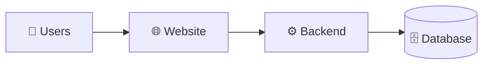
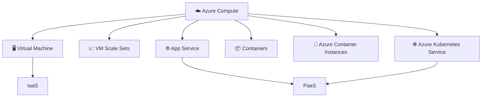
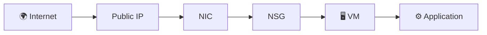
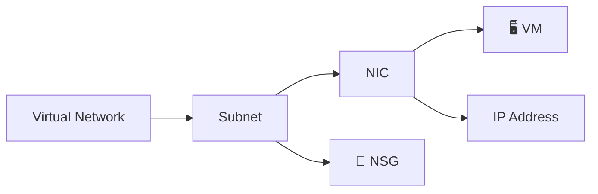
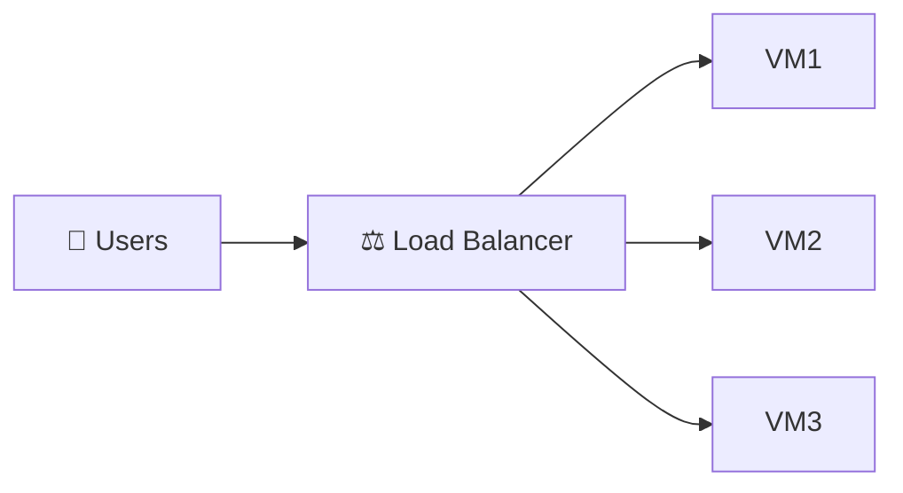
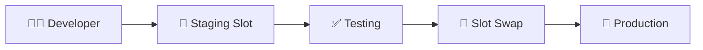
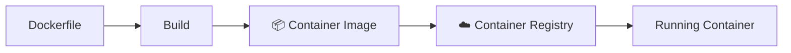
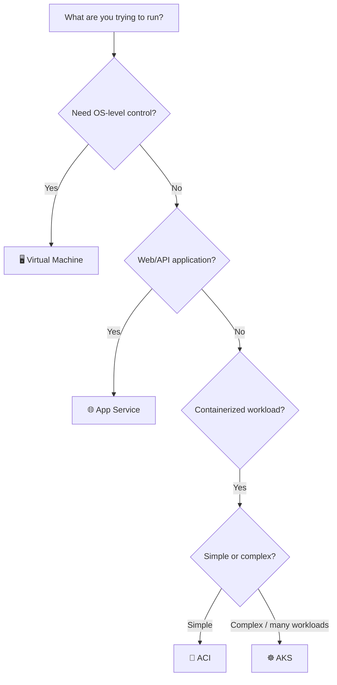
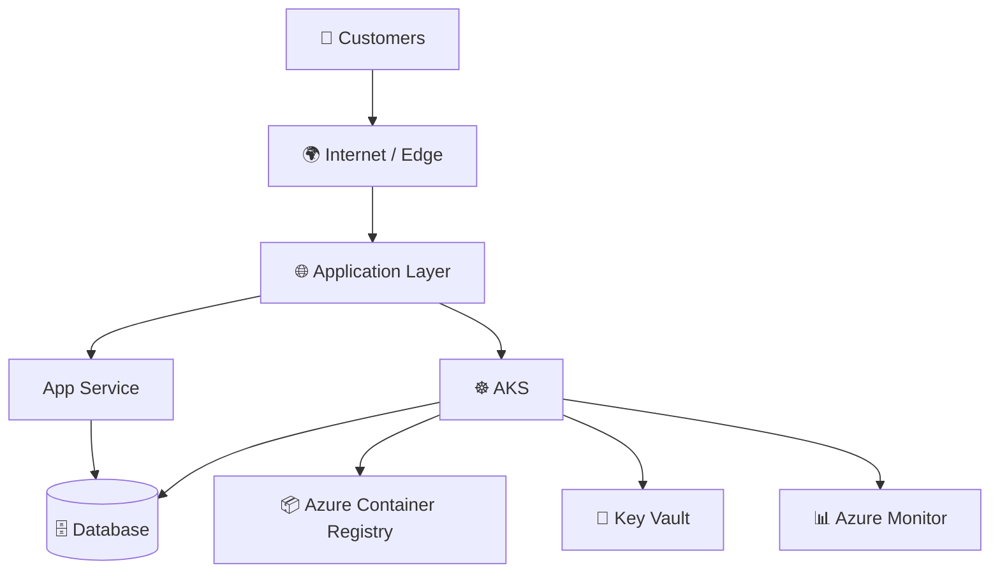

# ☁️ Azure Compute

<p align="center">
  
</p>

<h3 align="center">VM • VM Scale Sets • App Service • Containers • AKS • IaaS/PaaS/SaaS</h3>

<p align="center">
  <b>From “I need a server” → “I need a managed platform” → “I need Kubernetes”</b>
</p>


---

## 🎯 Learning Objective

- What is **Compute**?
- What is an **Azure VM**?
- When should you use **VM Scale Sets**?
- What does **App Service** solve?
- Why do we use **Containers**?
- What is **Azure Container Registry (ACR)**?
- When should you use **Azure Container Instances (ACI)**?
- Why does **AKS** exist?
- What is the difference between **IaaS, PaaS and SaaS**?
- Which Azure compute option fits a real-world application?

---

# 1. 🚀 Start With the Real Problem

Imagine you have an e-commerce website.



The application code cannot run by itself.

It needs:

| Resource | Purpose |
|---|---|
| 🧠 CPU | Executes instructions |
| 🧮 RAM | Temporary working memory |
| 💾 Storage | Stores OS/application/data |
| 🌐 Network | Communication |
| 🖥️ Operating System | Runs software |
| ⚙️ Runtime | Executes application code |

That processing environment is **Compute**.

> 💡 **Simple definition:** Compute = the resources used to run your workload.

---

# 2. 🏢 Traditional Server vs Azure

## Traditional Data Center

You buy and maintain:

```text
Physical Server
├── CPU
├── RAM
├── Disk
├── Network
├── Power
├── Cooling
├── Rack
└── Data Center
```

You are responsible for the physical infrastructure.

## Azure

You request a compute resource:

```text
Your Application
       ↓
Azure Compute
       ↓
Microsoft-managed Physical Infrastructure
```

Azure abstracts the physical hardware from you.

---

# 3. 🧩 Azure Compute — Big Picture



### The mental model

| Requirement | Think |
|---|---|
| “Give me a server.” | **VM** |
| “Give me many scalable servers.” | **VMSS** |
| “I only want to deploy my web/API application.” | **App Service** |
| “Package my application consistently.” | **Container** |
| “Run a simple container.” | **ACI** |
| “Manage many containerized workloads.” | **AKS** |

---

# 4. 🖥️ Azure Virtual Machine

> **Think of a VM as renting a computer inside Azure.**

A VM gives you significant control over the operating-system environment. Microsoft provides the physical infrastructure, while you still manage the guest VM, including configuration, patching, and installed software.

<p align="center">
  
</p>

### Typical VM components

```text
                  Azure VM
                     │
        ┌────────────┼────────────┐
        ↓            ↓            ↓
      CPU           RAM         Storage
        │                         │
        └────────────┬────────────┘
                     ↓
               Operating System
                     ↓
                Application
```

### VM = Control

You can control:

- OS
- Installed software
- Runtime
- Configuration
- Services
- System-level settings

---

# 5. 🔍 VM Components

| Component | Simple meaning |
|---|---|
| **vCPU** | Virtual processing capacity |
| **RAM** | Working memory |
| **OS Disk** | Operating system storage |
| **Data Disk** | Persistent application/data storage |
| **Temporary Disk** | Temporary/local storage where available |
| **NIC** | Network interface |
| **Private IP** | Internal network address |
| **Public IP** | Internet-facing address when configured |
| **NSG** | Network traffic rules |
| **Image** | Template used to create the VM |

### VM flow



---

# 6. 🧱 VM Image

An **image** is a template used to create a VM.

Examples:

```text
Ubuntu
Windows Server
Red Hat Enterprise Linux
SUSE Linux
```

Think:

```text
        VM Image
           │
     ┌─────┼─────┐
     ↓     ↓     ↓
    VM1   VM2   VM3
```

### Remember

> Image = Template  
> VM = Running computer created from that template

---

# 7. 💾 VM Storage

A VM can work with different types of storage.

### OS Disk

Contains the operating system.

```text
OS Disk
└── Ubuntu / Windows Server
```

### Data Disk

Used for persistent application data.

```text
Data Disk
├── Database files
├── Application files
└── Logs
```

### Temporary Disk

Used for temporary/local data where provided by the VM size.

> ⚠️ Do not treat temporary storage as your primary persistent data store.

---

# 8. 🌐 VM Networking

A VM normally connects to an Azure Virtual Network through a network interface.



### Important terms

**NIC**

> Network Interface Card — connects the VM to the network.

**Private IP**

> Used for internal/private communication.

**Public IP**

> Can provide internet-facing connectivity when configured.

**NSG**

> Controls allowed and denied network traffic.

---

# 9. 🛡️ NSG — Network Security Group

Think of an NSG as a **traffic rule book**.

```text
Internet
   │
   ↓
Port 443 ──→ ✅ Allow
Port 22  ──→ ⚠️ Only approved source
Port 3389 ─→ ⚠️ Only approved source
Other    ──→ ❌ Deny according to rules
```

Common administration ports:

| Protocol | Port | Typical use |
|---|---:|---|
| SSH | 22 | Linux administration |
| HTTP | 80 | Web traffic |
| HTTPS | 443 | Secure web traffic |
| RDP | 3389 | Windows administration |

> 🔐 In production, do not expose administrative ports broadly to the internet.

---

# 10. 🏢 Availability Set vs Availability Zone

## Availability Set

Distributes VMs across fault and update domains within the Azure infrastructure.

```text
Availability Set
├── Fault Domain 1 → VM1
├── Fault Domain 2 → VM2
└── Update Domains
```

## Availability Zone

Physically separate datacenter locations within an Azure region.

```text
Azure Region
├── Zone 1 → VM1
├── Zone 2 → VM2
└── Zone 3 → VM3
```

### Easy memory trick

> **Availability Set = distribute within infrastructure**  
> **Availability Zone = distribute across physically separate zones**

---

# 11. 📈 VM Scale Sets — VMSS

## The problem

One VM may not be enough.

```text
Normal traffic

Users
  ↓
 VM1
```

Peak traffic:

```text
Thousands of users
        ↓
┌───────┬───────┬───────┐
│ VM1   │ VM2   │ VM3   │
└───────┴───────┴───────┘
```

## The solution

**Virtual Machine Scale Sets** manage groups of VMs as a scalable resource.

```text
             VM SCALE SET
                  │
       ┌──────────┼──────────┐
       ↓          ↓          ↓
      VM1        VM2        VM3
```

---

# 12. ↕️ Scale Up vs Scale Out

## Scale Up

Increase the resources of a machine.

```text
4 vCPU / 16 GB
       ↓
8 vCPU / 32 GB
```

**Scale Up = bigger machine**

## Scale Out

Increase the number of machines.

```text
VM1 + VM2
    ↓
VM1 + VM2 + VM3 + VM4
```

**Scale Out = more machines**

### Remember

> **Up = Bigger**  
> **Out = More**

---

# 13. ⚖️ Load Balancer + VMSS

A common architecture:



The load balancer distributes incoming traffic among available backend instances.

VMSS can maintain and scale the VM instances.

---

# 14. 🌐 Azure App Service

Now ask:

> “Do I really want to manage an operating system just to host a web application?”

Often, the answer is **no**.

That's where **App Service** comes in.

Azure App Service is a managed platform for hosting web applications and APIs.

```text
Developer
    ↓
Application Code
    ↓
Azure App Service
    ↓
Azure-managed platform/infrastructure
```

Microsoft describes App Service as a PaaS offering that abstracts the underlying infrastructure so you can focus on application development. [Microsoft Learn](https://learn.microsoft.com/en-us/azure/well-architected/service-guides/app-service-web-apps)

---

# 15. 🆚 VM vs App Service

| | VM | App Service |
|---|---|---|
| OS control | High | Low |
| Server management | Customer | Mostly Azure |
| Application | Customer | Customer |
| Patching | Customer responsibility | Platform managed |
| Best for | Custom server workloads | Web/API workloads |
| Operational effort | Higher | Lower |

### Simple explanation

```text
VM
"I want to manage a server."

App Service
"I want to deploy an application."
```

---

# 16. 🧰 App Service Plan

An **App Service Plan** provides the compute environment for App Service apps.

Think:

```text
           App Service Plan
                  │
       ┌──────────┼──────────┐
       ↓          ↓          ↓
    Website      API     Admin Portal
```

The plan determines important characteristics such as:

- Region
- Pricing/SKU
- Available compute resources
- Scaling capabilities
- Operating-system/platform characteristics

> 💡 Multiple apps can share an App Service Plan, subject to its capacity and configuration.

---

# 17. 🔄 App Service Scaling

## Scale Up

Move to a more capable plan/SKU.

```text
Small
  ↓
Medium
  ↓
Large
```

## Scale Out

Increase the number of running instances.

```text
Instance 1
Instance 2
Instance 3
Instance 4
```

---

# 18. 🔀 Deployment Slots

Deployment slots provide separate deployment environments within an App Service app.

Typical flow:



### Why?

Instead of deploying a new version directly into production:

```text
New Version
    ↓
Staging
    ↓
Test
    ↓
Swap
    ↓
Production
```

This can make releases safer and reduce deployment disruption.

---

# 19. 📦 Containers

## What problem do containers solve?

Imagine:

```text
Developer Laptop
      ↓
"Works perfectly!"
      ↓
Test Server
      ↓
"Why is it failing?"
```

Different environments may have different:

- Libraries
- Runtime versions
- Configuration
- Dependencies

A container packages the application and its required dependencies into a consistent artifact.

```text
Application
+
Dependencies
+
Runtime
      ↓
📦 Container Image
```

---

# 20. 🏗️ Container Image

A typical workflow:



Example:

```text
myapp:1.0
myapp:1.1
myapp:2.0
```

> **Image = packaged application artifact**  
> **Container = running instance of that image**

---

# 21. 🗄️ Azure Container Registry — ACR

**Azure Container Registry** is a managed private registry for storing container images and related artifacts.

```text
Developer
    ↓
Build Image
    ↓
┌─────────────────────────┐
│ Azure Container Registry│
│                         │
│ myapp:1.0               │
│ myapp:1.1               │
│ myapp:2.0               │
└─────────────────────────┘
    ↓
AKS / ACI / App Service
```

Microsoft Learn describes ACR as a managed registry for storing and managing private container images and related artifacts.

---

# 22. 🚀 Azure Container Instances — ACI

ACI is useful when you want to run a container without managing a Kubernetes cluster.

```text
Container Image
      ↓
     ACI
      ↓
Running Container
```

### Good fit for

- Simple container workloads
- Jobs
- Short-lived workloads
- Development/testing
- Burst scenarios

### Simple memory trick

> **ACI = “Just run this container.”**

---

# 23. ☸️ Why Kubernetes?

Imagine your application has:

```text
Frontend       → 20 containers
Backend        → 50 containers
Authentication → 15 containers
Payment        → 10 containers
Notifications  → 10 containers
```

Now ask:

- Which machine should run each container?
- What happens when one crashes?
- How do we scale?
- How do services find each other?
- How do we deploy a new version?
- How do we manage hundreds of workloads?

Doing everything manually becomes difficult.

That's the problem Kubernetes addresses.

---

# 24. ☸️ Azure Kubernetes Service — AKS

**AKS = Azure Kubernetes Service**

AKS provides managed Kubernetes capabilities on Azure.

<p align="center">
  
</p>

A real Microsoft reference architecture for AKS shows multiple microservices deployed in a Kubernetes environment with ingress/load balancing, Azure Container Registry, monitoring, and supporting services.

### AKS is useful when you need

- Container orchestration
- Many containerized workloads
- Automated workload scheduling
- Scaling
- Service discovery
- Rolling deployments
- Kubernetes ecosystem capabilities

---

# 25. 🧠 VM → VMSS → App Service → Container → AKS

This is the most important progression.

```text
                    AZURE COMPUTE

                         │
                         ▼
                    🖥️ VM
               "I need a server."
                         │
                         ▼
                   📈 VMSS
             "I need scalable VMs."
                         │
                         ▼
                 🌐 App Service
          "I need to host my web/API app."
                         │
                         ▼
                   📦 Container
           "Package my app consistently."
                         │
                         ▼
                    🚀 ACI
             "Run this container."
                         │
                         ▼
                    ☸️ AKS
       "Manage many containerized workloads."
```

---

# 26. 🧭 Choosing the Right Compute



---

# 27. ☁️ IaaS vs PaaS vs SaaS

The biggest difference is:

> **Who manages what?**

```text
More Customer Control
        ↑
        │
       IaaS
        │
       PaaS
        │
       SaaS
        │
        ↓
Less Infrastructure Management
```

---

# 28. 🏗️ IaaS — Infrastructure as a Service

Azure provides infrastructure resources.

Example:

**Azure Virtual Machine**

```text
Customer manages
├── Application
├── Runtime
├── OS
└── Configuration

Azure manages
├── Physical servers
├── Datacenter
├── Physical networking
└── Underlying infrastructure
```

### Think:

> **“Give me infrastructure.”**

---

# 29. 🛠️ PaaS — Platform as a Service

Azure provides a managed application platform.

Example:

**Azure App Service**

```text
Customer manages
├── Application
├── Application configuration
└── Data

Azure manages much of
├── Platform
├── OS
├── Runtime
└── Infrastructure
```

### Think:

> **“Give me a platform so I can focus on my application.”**

---

# 30. 🧑‍💻 SaaS — Software as a Service

You consume a complete software product.

```text
Provider
   ↓
Complete Software
   ↓
You
   ↓
Login + Configure + Use
```

Examples:

- Microsoft 365
- Microsoft Teams
- Salesforce
- ServiceNow

### Think:

> **“I don't want to build it. I want to use it.”**

---

# 31. ⚖️ Shared Responsibility

Cloud does not mean:

> “Azure manages everything.”

Responsibilities are shared.

```text
                 Cloud Responsibility

              ┌──────────────────┐
              │    Customer      │
              │                  │
              │ Application      │
              │ Data             │
              │ Identity         │
              │ Access           │
              │ Configuration    │
              └──────────────────┘
                       ▲
                       │
              Depends on service
                       │
                       ▼
              ┌──────────────────┐
              │      Azure       │
              │                  │
              │ Physical hardware│
              │ Datacenter       │
              │ Core platform    │
              └──────────────────┘
```

The exact boundary changes between IaaS, PaaS, and SaaS.

---

# 32. 📊 Final Comparison

| | VM | VMSS | App Service | ACI | AKS |
|---|---|---|---|---|---|
| Server control | ⭐⭐⭐⭐⭐ | ⭐⭐⭐⭐⭐ | ⭐ | ⭐⭐ | ⭐⭐⭐ |
| Infrastructure management | High | High | Low | Low | Medium |
| Scaling | Manual/VMSS | Built-in scaling | Built-in options | Service-dependent | Kubernetes |
| Container required | ❌ | ❌ | ❌ | ✅ | ✅ |
| Kubernetes | ❌ | ❌ | ❌ | ❌ | ✅ |
| Typical use | Custom servers | Scalable VMs | Web/API | Simple containers | Container platforms |

> ⭐ Ratings above represent **relative control/management characteristics**, not quality rankings.

---

# 33. 🛒 Real-World E-Commerce Architecture

Imagine an online shopping platform.



Possible responsibilities:

```text
Frontend / API
       ↓
App Service or AKS

Container Images
       ↓
ACR

Secrets
       ↓
Key Vault

Data
       ↓
Database

Observability
       ↓
Azure Monitor
```

---

# 34. 🎤 Trainer Explanation — 60 Seconds

If you need to explain the whole topic quickly:

> **“Azure Compute means the processing resources used to run our applications. If I want complete control over a server, I use a Virtual Machine. If I need a group of scalable VMs, I use VM Scale Sets. If I have a web/API application and don't want to manage the server, App Service gives me a managed platform. If I want to package my application consistently, I use containers. ACI can run a simple container without Kubernetes. When the application grows into many containerized workloads, AKS provides Kubernetes orchestration. These choices also map to the broader cloud models: VM is commonly IaaS, App Service is PaaS, and SaaS is a complete software product.”**

---

# 35. 🧠 Interview Quick Revision

### What is Compute?

> Processing resources required to run workloads.

### What is a VM?

> A virtual computer running on Azure infrastructure.

### What is VMSS?

> A service for deploying and managing groups of VMs with scaling capabilities.

### Scale Up?

> Increase resources of an instance.

### Scale Out?

> Increase the number of instances.

### What is App Service?

> A managed PaaS hosting platform for web applications and APIs.

### What is a container?

> A packaged application environment containing the application and its required dependencies.

### What is ACR?

> Azure's managed private container registry.

### What is ACI?

> A service for running containers without directly managing a VM or Kubernetes cluster.

### What is AKS?

> Azure's managed Kubernetes service.

### IaaS?

> Infrastructure as a Service.

### PaaS?

> Platform as a Service.

### SaaS?

> Software as a Service.

---

# 36. 🧩 One-Line Memory Map

```text
VM
↓
"I need a server."

VMSS
↓
"I need scalable servers."

App Service
↓
"I need to host a web/API application."

Container
↓
"I need a portable application package."

ACR
↓
"I need somewhere to store my container images."

ACI
↓
"I just want to run a container."

AKS
↓
"I need Kubernetes to manage containerized workloads."

IaaS
↓
"Give me infrastructure."

PaaS
↓
"Give me a managed platform."

SaaS
↓
"Give me the complete software."
```

---

# 37. 🏁 Final Mental Model

```text
                    AZURE COMPUTE
                          │
        ┌─────────────────┼─────────────────┐
        │                 │                 │
        ▼                 ▼                 ▼
      🖥️ VM          🌐 App Service     📦 Containers
        │                 │                 │
      VMSS              PaaS              ACI
                                          │
                                          ▼
                                         AKS


                    CLOUD MODELS
                          │
             ┌────────────┼────────────┐
             ▼            ▼            ▼
            IaaS         PaaS         SaaS
             │            │            │
            VM       App Service   Complete App
```

---

## 📚 Official Microsoft References

- [Azure Virtual Machines](https://learn.microsoft.com/en-us/azure/virtual-machines/overview)
- [Azure VM baseline architecture](https://learn.microsoft.com/en-us/azure/architecture/reference-architectures/n-tier/high-security-iaas)
- [Azure App Service architecture guidance](https://learn.microsoft.com/en-us/azure/well-architected/service-guides/app-service-web-apps)
- [Azure App Service baseline architecture](https://learn.microsoft.com/en-us/azure/architecture/web-apps/app-service/architectures/baseline-zone-redundant)
- [AKS microservices reference architecture](https://learn.microsoft.com/en-us/azure/architecture/reference-architectures/containers/aks-microservices/aks-microservices)
- [Azure Architecture Center](https://learn.microsoft.com/en-us/azure/architecture/)

---

## 🎓 Recommended Classroom Flow

```text
01 → What is Compute?
       ↓
02 → Why do we need servers?
       ↓
03 → Virtual Machine
       ↓
04 → VM Components
       ↓
05 → VM Networking
       ↓
06 → VMSS + Scaling
       ↓
07 → App Service
       ↓
08 → Containers
       ↓
09 → ACR
       ↓
10 → ACI
       ↓
11 → Why Kubernetes?
       ↓
12 → AKS
       ↓
13 → IaaS / PaaS / SaaS
       ↓
14 → Real-world architecture
       ↓
15 → Interview Revision
```

> **Teaching principle:** Don't start with definitions. Start with the **problem**, then introduce the Azure service that solves it.
